<div align="center">

# Maham Shahid
### Software Engineer | Artificial Intelligence

<a href="https://git.io/typing-svg">
  
</a>


<br/>


</div>

<br/>

## 👩🏻‍💻 Who I Am

```typescript
const maham = {
  title: "Software Engineer",
  focus: "Artificial Intelligence",
  stack: [
    "Python", "C++", "Java", "SQL",
    "Deep Learning", "Reinforcement Learning",
    "Multi-Agent Systems", "AI Agents",
    "RESTful APIs", "SUMO", "Simulations",
    "Data Analysis & Visualization",
    "HTML", "CSS"
  ],
  softSkills: [
    "Teamwork", "Team Lead", "Project Management",
    "Communication", "Analytical Thinking", "Problem Solving"
  ],
  launchedProjects: [
    "FYP: Intelligent Multi-Agent RL Framework for Adaptive Traffic Signal Control",
    "AQI Predictor — real-time air quality prediction app",
    "Calculator GUI, Music GUI, Plagiarism Checker, Password Generator",
    "Desktop Chat Application, DSA Bank Management System"
  ],
  certifications: [
    "Responsible AI: Applying AI Principles with Google Cloud",
    "Google AI Essentials — Coursera",
    "Automated Machine Learning (AutoML) for Beginners — Udemy"
  ],
  status: "Building, learning, and shipping AI-powered projects",
  openTo: "Software Engineering / AI-ML roles"
};
```

<br/>

## 🚀 Featured Projects

### 🚦 Intelligent Multi-Agent Reinforcement Learning Framework for Adaptive Traffic Signal Control

**Final Year Project**

<table>
<tr>
<td width="60%">

<a href="https://github.com/maham-bhatti/FYP-Traffic">
  
</a>

</td>
<td width="40%">

| Layer | Technology |
|---|---|
| Language | Python |
| Domain | Multi-Agent Reinforcement Learning |
| Simulation | SUMO |

</td>
</tr>
</table>

**💻 [Code](https://github.com/maham-bhatti/FYP-Traffic)**

<br/>

### 🌫️ AQI Predictor

<table>
<tr>
<td width="60%">

<a href="https://github.com/maham-bhatti/aqi-predictor">
  
</a>

</td>
<td width="40%">

| Layer | Technology |
|---|---|
| Language | Python |
| Domain | Machine Learning |
| Deployment | Streamlit |

</td>
</tr>
</table>

**🔗 [Live App](https://aqi-predictor-natgjjfhdmgmvne6pkd9op.streamlit.app/)** &nbsp;•&nbsp; **💻 [Code](https://github.com/maham-bhatti/aqi-predictor)**

<br/>

### 🏦 DSA Bank Management System

<table>
<tr>
<td width="60%">

<a href="https://github.com/maham-bhatti/DSA-Bank-Project">
  
</a>

</td>
<td width="40%">

| Layer | Technology |
|---|---|
| Language | C++ |
| Domain | Data Structures & Algorithms |

</td>
</tr>
</table>

**💻 [Code](https://github.com/maham-bhatti/DSA-Bank-Project)**

<br/>

### 💬 Desktop Chat Application

<table>
<tr>
<td width="60%">

<a href="https://github.com/maham-bhatti/desktop-application">
  
</a>

</td>
<td width="40%">

| Layer | Technology |
|---|---|
| Language | Python |
| Type | Real-time desktop conversation app |

</td>
</tr>
</table>

**💻 [Code](https://github.com/maham-bhatti/desktop-application)**

<br/>

### 📝 Plagiarism Checker

<table>
<tr>
<td width="60%">

<a href="https://github.com/maham-bhatti/Plagiarism-Checker">
  
</a>

</td>
<td width="40%">

| Layer | Technology |
|---|---|
| Language | Python |
| Type | Text similarity detection GUI |

</td>
</tr>
</table>

**💻 [Code](https://github.com/maham-bhatti/Plagiarism-Checker)**

<br/>

### 🎵 Music GUI

<table>
<tr>
<td width="60%">

<a href="https://github.com/maham-bhatti/Music-GUI">
  
</a>

</td>
<td width="40%">

| Layer | Technology |
|---|---|
| Language | Python |
| Type | GUI music player |

</td>
</tr>
</table>

**💻 [Code](https://github.com/maham-bhatti/Music-GUI)**

<br/>

### 🧮 Calculator GUI

<table>
<tr>
<td width="60%">

<a href="https://github.com/maham-bhatti/Calculator-GUI">
  
</a>

</td>
<td width="40%">

| Layer | Technology |
|---|---|
| Language | Python |
| Type | GUI calculator |

</td>
</tr>
</table>

**💻 [Code](https://github.com/maham-bhatti/Calculator-GUI)**

<br/>

### 🔑 Password Generator

<table>
<tr>
<td width="60%">

<a href="https://github.com/maham-bhatti/passwordGenerator">
  
</a>

</td>
<td width="40%">

| Layer | Technology |
|---|---|
| Language | Python |
| Type | Secure random password generator |

</td>
</tr>
</table>

**💻 [Code](https://github.com/maham-bhatti/passwordGenerator)**

<br/>

## 🎓 Certifications

- 🎖️ **Responsible AI: Applying AI Principles with Google Cloud** — *Mar 2024*
- 🎖️ **Google AI Essentials** — *Coursera, Aug 2024* — [Verify](https://www.credly.com/go/xibGehbj)
- 🎖️ **Automated Machine Learning (AutoML) for Beginners** — *Udemy, May 2024*

<br/>

## 🛠️ Tech Stack

**Languages**


**Frontend**


**AI / ML / Data**


**Core Strengths**


<br/>

## 📊 GitHub Stats

<div align="center">



</div>

<br/>

## 📈 Contribution Activity

<div align="center">

</div>

<br/>

## 🤝 Connect With Me

<div align="center">

<a href="https://www.linkedin.com/in/maham-shahid7">
  
</a>
<a href="https://mail.google.com/mail/?view=cm&fs=1&to=maham.bhatti963@gmail.com" target="_blank">
  
</a>

</div>

<br/>

<div align="center">

### Thanks for visiting! ✨

</div>
